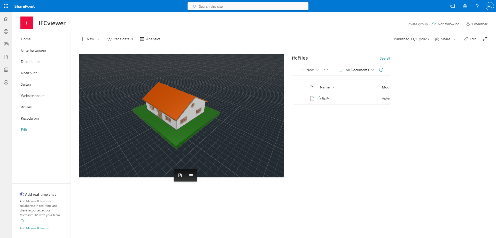

# SPFx_IFC-Viewer

A simple IFC viewer as SPFx app for SharePoint and MS Teams

## step 1 / IFC Viewer

A simple IFC viewer based on open source tools from [The Open Company](https://people.thatopen.com/home)

Test deployment on GitHub pages: [IFC-Viewer](https://golfomania.github.io/SPFx_IFC-Viewer/dist/index.html)

## step 2 / SPFx App

Based on the IFC Viewer a SPFx app was created. The app is deployed to a SharePoint site collection app catalog.

## step 3 / SPFx App as Teams app

The teams plug in in VS code supports to create a Teams app based on the existing SPFx app.
But on the current developement status (hard coded "get first file of ITCfiles document library") this doesn't make sense.

## ToDo

- [x] IFC Viewer
- [x] SPFx App
- [ ] add floor view feature
- [ ] add explosion view feature
- [ ] menu to select IFC file out of all files in document library
- [ ] SPFx App as Teams app
